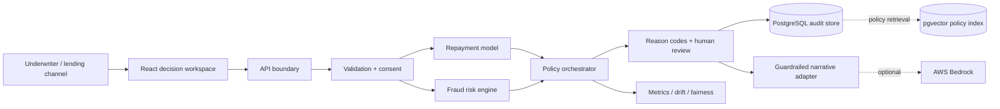

# CredIntel AI

Explainable, real-time underwriting for new-to-credit applicants. CredIntel combines consented alternative-data signals, an interpretable repayment model, fraud controls, policy rules, and human review in one auditable decision record.

> Prototype boundary: this project demonstrates engineering architecture and responsible-AI controls. It is not validated for real lending decisions and must not be used to approve or deny actual credit.

## Why this solution stands out

- Separates **repayment confidence**, **fraud risk**, and **policy checks** instead of hiding them in one score.
- Uses one versioned logistic model artifact across the React demo and Spring Boot API.
- Gives feature-level reason codes that are tied to actual model contributions.
- Fails closed when alternative-data consent is absent.
- Keeps the LLM outside the decision path: Bedrock can summarize approved evidence but cannot alter scores or recommendations.
- Includes model monitoring, fairness evaluation, drift indicators, an audit trail, API tests, and infrastructure-as-code.

## Architecture



The local demo uses a Cloudflare-compatible React server route as a resilient fallback. Set `BACKEND_URL` to route the same API calls to Spring Boot. The production target maps to CloudFront/WAF, ECS or EKS, RDS PostgreSQL with pgvector, Bedrock, Secrets Manager, Cognito, and CloudWatch.

## Quick start

### Frontend demo

Requirements: Node.js 22+

```bash
npm ci
npm run dev
```

Open `http://localhost:3000`. Use **New application** to switch among strong, borderline, and high-fraud scenarios.

### Spring Boot API

Requirements: Java 21+ and Maven 3.9+

```bash
cd backend
mvn spring-boot:run
```

The default profile uses an in-memory H2 database in PostgreSQL compatibility mode. The health endpoint is `http://localhost:8080/actuator/health`.

### Full stack with PostgreSQL + pgvector

Requirements: Docker with Compose

```bash
cp .env.example .env
docker compose -f infra/docker-compose.yml up --build
```

The web app is available on port `3000`, the API on `8080`, and PostgreSQL on `5432`.

## API example

```bash
curl -X POST http://localhost:8080/api/v1/decisions \
  -H 'Content-Type: application/json' \
  --data @docs/sample-request.json
```

The contract is documented in [`docs/openapi.yaml`](docs/openapi.yaml). When `APP_API_KEY` is set, all `/api/v1/**` calls require the `X-API-Key` header.

## Reproduce the model

The default training path uses only the Python standard library:

```bash
python3 ml/train_model.py
```

It generates 8,000 deterministic synthetic profiles, trains a non-negative regularized logistic scorecard, writes the shared model artifact, creates a 200-row sample, and emits validation metrics. Protected evaluation groups are never model inputs.

To use public Home Credit data after accepting Kaggle's rules:

```bash
python3 ml/import_home_credit.py /path/to/application_train.csv /tmp/home-credit-features.csv
```

See [`docs/data-sources.md`](docs/data-sources.md) and [`docs/model-card.md`](docs/model-card.md) before replacing synthetic data.

## Tests

```bash
npm test
cd backend && mvn test
```

Coverage focuses on the highest-risk behavior: consent, model output, fraud escalation, policy review, payload validation, server rendering, and model metadata.

## Security and responsible AI

- No secrets are committed; runtime credentials come from environment variables or a secret manager.
- API-key enforcement is constant-time and optional only for local demo mode.
- Inputs have explicit size/range validation, CORS is allow-listed, CSRF is disabled only for the stateless API, and security headers are enabled.
- Applicant references are SHA-256 pseudonymized in indexed records; raw alternative-data content is not logged.
- Protected traits and contact-list content are excluded from the model contract.
- Every recommendation carries versioned reason codes, policy checks, latency, model version, and a human-review flag.
- Bedrock is opt-in (`AI_PROVIDER=bedrock`) and constrained to summarizing supplied evidence.

The concise threat model is in [`docs/threat-model.md`](docs/threat-model.md).

## Repository map

```text
app/          React underwriting workspace and resilient API routes
backend/      Spring Boot API, persistence, security, Bedrock adapter, tests
lib/          Shared TypeScript scoring contract and versioned model artifact
ml/           Synthetic training pipeline, public-data adapter, model report
infra/        Docker Compose and PostgreSQL/pgvector initialization
docs/         OpenAPI, architecture, data, model card, demo and submission notes
submission/   Final roll-number-named delivery files
```

## Demo flow

1. Show the strong profile and open the feature-level explanation.
2. Run the borderline preset to demonstrate a model-positive case routed to human review by the DTI policy.
3. Run the fraud preset to show that a plausible income profile is still stopped by identity/device risk.
4. Open model monitoring and call out AUC, fairness gap, drift, and model ownership.
5. Open the audit trail and finish with the LLM decision boundary.

The submitted 59-second narration is in [`docs/demo-narration.txt`](docs/demo-narration.txt). A longer three-minute interview script is in [`docs/demo-script.md`](docs/demo-script.md).

## Build the submission ZIP

The checked-in artifacts use `ROLL_NUMBER` until the candidate number is known. Repackage everything with the exact roll number using:

```bash
./scripts/package_submission.sh YOURROLLNUMBER
```

This creates `submission/YOURROLLNUMBER.zip` containing the same-named PPTX, PDF, MP4, and a clean source snapshot. Generated dependencies, build output, credentials, Git history, and temporary files are excluded.
